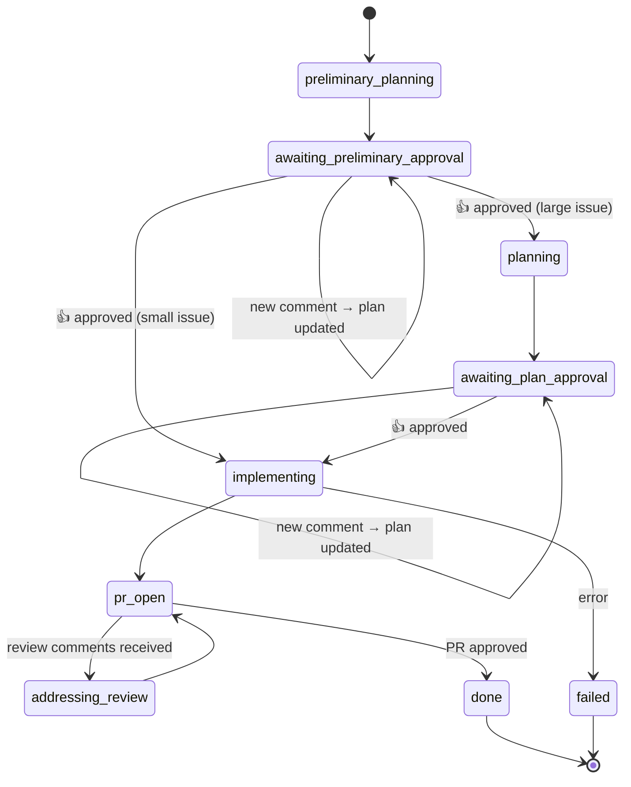

<p align="center">
  
</p>

# Clayde

Clayde is a persistent autonomous AI software agent that lives on a dedicated VM and works GitHub issues end-to-end — researching codebases, writing plans, implementing solutions, and opening pull requests.

---

## What is Clayde?

Clayde is assigned GitHub issues in software repositories. For each issue it:

1. Researches the codebase and writes a **preliminary plan**, posting it as a GitHub comment
2. Waits for human approval (a 👍 reaction) before continuing
3. For **large issues**: writes a **detailed implementation plan** and posts it as another comment, then waits for approval again before touching any code. For **small issues**: skips directly to implementation after preliminary approval.
4. Implements the solution on a new branch, opens a pull request, and posts a summary comment
5. Addresses any review comments left on the PR

At any point while waiting for approval, new comments on the issue will trigger a plan update — Clayde revises the plan and posts a summary of what changed.

Clayde runs as a Docker container in a continuous loop (default: every 5 minutes), driven by a state machine persisted in `data/state.json`.

---

## State Machine

Each issue moves through the following states:



| State | Description |
|---|---|
| `preliminary_planning` | Claude explores the codebase and writes a short overview with clarifying questions |
| `awaiting_preliminary_approval` | Preliminary plan posted; waiting for 👍 from an approver. New comments trigger a plan update. Small issues skip to `implementing` on approval; large issues proceed to `planning`. |
| `planning` | Claude writes a detailed implementation plan |
| `awaiting_plan_approval` | Full plan posted; waiting for 👍 from an approver. New comments trigger a plan update. |
| `implementing` | Claude implements the solution on a new branch |
| `pr_open` | PR opened; monitoring for review comments |
| `addressing_review` | Claude is addressing PR review comments |
| `done` | PR approved; issue complete |
| `failed` | Error occurred; requires manual reset to retry |
| `interrupted` | Claude hit a usage/rate limit; retried automatically next cycle |

---

## Safety & Content Filtering

Clayde uses **content filtering** rather than gatekeeping which issues to work on. It will only act on content that is visible:

- An issue body or comment is **visible** if it was written by a whitelisted user, or has a 👍 reaction from a whitelisted user.
- If an issue has no visible content at all, it is skipped.
- Blocked issues (those with "blocked by #N" or "depends on #N" in the body) are also skipped.

Two approval gates then guard forward progress:

1. **Preliminary plan approval** — a 👍 from a whitelisted user on the preliminary plan comment is required before the full plan is written.
2. **Plan approval** — a 👍 from a whitelisted user on the full plan comment is required before implementation begins.

Whitelisted users are configured via `CLAYDE_WHITELISTED_USERS` in `data/config.env`.

---

## Capabilities

- **Multi-repo support**: Clones and works on any GitHub repository it has access to
- **Two-phase planning**: Preliminary exploration followed by a detailed plan, each gated by human approval
- **Full issue lifecycle**: Plan → approval → implement → PR, with comments at each stage
- **PR review handling**: Reads and addresses reviewer feedback automatically
- **Rate-limit resilience**: Detects Claude usage limits and automatically retries
- **Safety gates**: Whitelist + approval checks prevent unauthorized work
- **Observability**: OpenTelemetry tracing with JSONL file export
- **Dual Claude backend**: Use the Anthropic API (pay-per-token) or the Claude Code CLI (subscription-based)

---

## Tech Stack

| Component | Tool |
|---|---|
| Language | Python 3.13 |
| Package manager | `uv` |
| LLM | Claude (Anthropic SDK or Claude Code CLI) |
| GitHub API | PyGitHub |
| Deployment | Docker (continuous loop) |
| Configuration | pydantic-settings |
| Templating | Jinja2 |
| Observability | OpenTelemetry |
| State persistence | `state.json` |

---

## Setup

### 1. Create a dedicated bot GitHub account

Create a GitHub account for your bot (e.g. `my-bot`). This is the account that will be assigned issues and open pull requests.

### 2. Create a GitHub Personal Access Token for the bot

From the bot account, create a classic personal access token with the full **`repo`** scope.

### 3. Configure the instance

```bash
mkdir -p data/logs data/repos
cp config.env.template data/config.env
```

Edit `data/config.env`:

```
CLAYDE_GITHUB_TOKEN=github_pat_...
CLAYDE_GITHUB_USERNAME=my-bot
CLAYDE_GIT_EMAIL=my-bot@example.com
CLAYDE_ENABLED=true
CLAYDE_WHITELISTED_USERS=your-username,my-bot
```

See [Configuration](#configuration) for all available settings.

### 4. Choose a Claude backend

Clayde supports two backends for invoking Claude, selected by `CLAYDE_CLAUDE_BACKEND` in `data/config.env`:

#### Option A: Anthropic API (`api`, default)

Uses the Anthropic Python SDK with a tool-use loop. Pay-per-token.

1. Get an API key from [console.anthropic.com](https://console.anthropic.com/)
2. Set in `data/config.env`:
   ```
   CLAYDE_CLAUDE_BACKEND=api
   CLAYDE_CLAUDE_API_KEY=sk-ant-...
   ```

#### Option B: Claude Code CLI (`cli`)

Runs the Claude Code CLI as a subprocess. Uses your Claude Pro/Max subscription — no per-token cost.

1. On the host machine, log in to the CLI:
   ```bash
   claude login
   ```
2. Set in `data/config.env`:
   ```
   CLAYDE_CLAUDE_BACKEND=cli
   ```
   (`CLAYDE_CLAUDE_API_KEY` is not required for the CLI backend.)

The `docker-compose.yml` mounts `~/.claude/.credentials.json` from the host directly into the container. Token refreshes, logouts, and account switches on the host are immediately reflected.

### 5. Start the container

```bash
docker compose up -d
```

Clayde will start its loop, checking for assigned issues every 5 minutes (configurable via `CLAYDE_INTERVAL`).

### 6. Assign issues to your bot

In any repository the bot has access to, assign issues to the bot account. Clayde will pick them up automatically on the next loop cycle.

---

## Configuration

`data/config.env` (plain `KEY=VALUE`, all prefixed with `CLAYDE_`):

| Key | Purpose |
|---|---|
| `CLAYDE_GITHUB_TOKEN` | Classic PAT with full `repo` scope |
| `CLAYDE_GITHUB_USERNAME` | The bot account username |
| `CLAYDE_GIT_NAME` | Git commit author name (defaults to `CLAYDE_GITHUB_USERNAME` if not set) |
| `CLAYDE_GIT_EMAIL` | Git commit author email (required) |
| `CLAYDE_ENABLED` | Set to `true` to activate |
| `CLAYDE_WHITELISTED_USERS` | Comma-separated trusted GitHub usernames |
| `CLAYDE_INTERVAL` | Loop interval in seconds (default: `300`) |
| `CLAYDE_CLAUDE_BACKEND` | `api` (default) or `cli` |
| `CLAYDE_CLAUDE_API_KEY` | Anthropic API key (required when backend=`api`) |
| `CLAYDE_CLAUDE_MODEL` | Model to use (default: `claude-opus-4-6`) |
